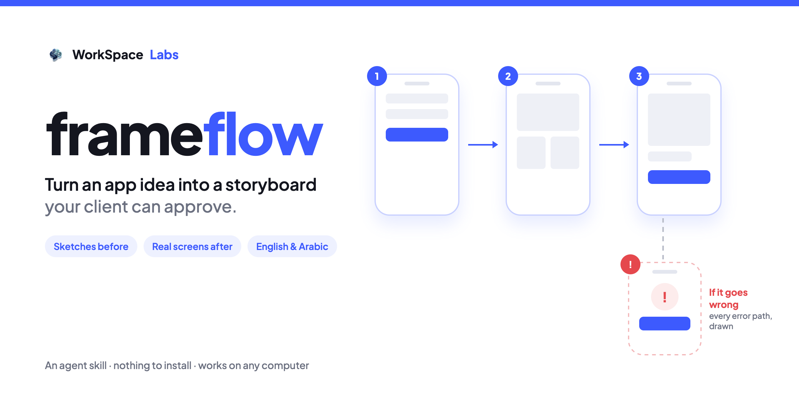

# frameflow



**Turn an app idea into a storyboard your client can approve.**

An agent skill that draws an app's **screens as a storyboard**: numbered frames left to right like a comic
strip, a short caption under each ("Types email and password, taps Sign in"), blue arrows for the normal
path, and red dashed frames for what happens when something goes wrong. Sketches before you build; real
screenshots after. The client approves it before a line of code is written.

The skill is the folder [`skills/frameflow/`](skills/frameflow/): its instructions,
[`SKILL.md`](skills/frameflow/SKILL.md), and a page template that draws the storyboard in any browser.
**Nothing to install.**

**Version 0.1.1** · 64 tests · reviewed over 4 rounds by a second AI · [how it was tested](TESTING.md)

---

## What you get

In your project's `docs/app-flow/`:

| File | What it is |
|---|---|
| `app-flow.md` | the storyboard as short, readable text: the master copy any agent can read and update |
| `storyboard.html` | the page that draws it (open it in Chrome, Edge or Safari) |
| `<Project> - App flow v1.pdf` | the PDF for the client: a cover, then one page per user story |
| `screenshots/` | after building: the real screens |

The PDF holds:

1. **A cover**: the app's name, one line about it, **Draft for review** or **Approved** with the date, the
   stories with their pages, and who it is for.
2. **One page per user story** ("Signing in", "Ordering food"): the screens in order, each with its caption,
   the arrows between them, and every "if it goes wrong" frame with its way back. A long story continues on
   a "part 2" page.

Four frames: **phone**, **tablet**, **desktop window** and **browser** (a website can also show its phone
version). English by default; **Arabic** turns the whole page right to left.

## How it works

1. The agent asks two things first: **what kind of project** it is, and **whether you have a workflow** for
   it (if you use [workflow-project](https://github.com/workspace-labs/workflow-project), it builds from it).
2. It **asks about the screens** in small rounds (who uses it, what they see first, what they do, what can
   go wrong), then **reads the plan back** until you say "yes, that's it".
3. It writes `app-flow.md` and copies the template; **the page draws itself**. If a line is wrong or a
   caption does not fit, the page refuses with numbered problems instead of a messy drawing.
4. It makes the PDF (with the Chrome or Edge you already have), or tells you the exact Print settings.
5. **The client approves**, or asks for changes: each round is a new version (v1, v2…).
6. **After building**, it swaps the sketches for real screenshots, after warning you to use demo data.

## Install

The storyboard needs only a browser. The skill needs nothing else.

**Claude Code, Codex and other agents**, in one line:

```bash
npx skills add workspace-labs/frameflow -g
```

Or by hand, for Claude Code:

```bash
git clone https://github.com/workspace-labs/frameflow.git
mkdir -p ~/.claude/skills
cp -R frameflow/skills/frameflow ~/.claude/skills/
```

**Claude app (chat and Cowork)**: make the zip, then upload it in **Customize → Skills**.

```bash
cd frameflow
rm -f dist/frameflow.zip && mkdir -p dist
(cd skills && zip -r -X ../dist/frameflow.zip frameflow -x '*.DS_Store')
```

**GitHub Copilot, Cursor and ChatGPT**: where your tool supports agent skills, install the same folder.
Not tested yet.

Then start a fresh session and ask for an app flow. The agent asks its questions first, then hands over the
storyboard.

## Try it without an agent

Open [`skills/frameflow/assets/template/storyboard.html`](skills/frameflow/assets/template/storyboard.html)
in a browser. To see an example, paste the text of one of the files in
[`skills/frameflow/examples/`](skills/frameflow/examples/) between the two `app-flow` lines in that file, and
reload.

## The text copy

```markdown
# Food Delivery App

- kind: phone
- version: 1

## Ordering food
From choosing a restaurant to the order confirmed.

1. Home [grid]: Sees nearby restaurants, taps one. → 2
2. Pay [form]: Enters the card, taps "Pay now". → 3
   ! Card refused: Sees "Payment failed", taps "Try again". → 2
3. Confirmed [done]: Sees the order number.
```

The full shape is in [`references/storyboard-format.md`](skills/frameflow/references/storyboard-format.md).

## How it was tested

64 automated tests (Node.js 18, 20 and 22), 8 planted bugs all caught, and 4 rounds of independent review
by a second AI (OpenAI Codex) that found 11 problems, all fixed before release. The full record, and what has
not been tried yet, is in [`TESTING.md`](TESTING.md).

## Limits

- Up to 12 stories and 24 screens a story; up to two "if it goes wrong" frames under a screen.
- English and Arabic.
- The look is fixed: a white page, a thin blue line on top, Plus Jakarta Sans. Your own name goes on the
  cover; one small "Made with frameflow · by WorkSpace Labs" line sits at the bottom of the last page.

## Working on frameflow

See [`AGENTS.md`](AGENTS.md). Tests: `node --test` (Node.js 18 or newer, for the tests only).

## Licence

MIT, see [`LICENSE`](LICENSE). The fonts (Plus Jakarta Sans, Noto Naskh Arabic) keep their SIL Open Font
License; see [`CREDITS.md`](CREDITS.md).
